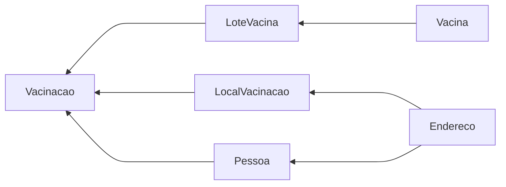

# Desafio MVC - Sistema de gerenciamento de vacinas

Este projeto é uma aplicação que simula um sistema de gerenciamento de vacinas.
Nele é possível que usuários comuns(sem login) consultem os **Locais**, **Lotes** e **Vacinas** ativos no sistema para disseminar a informação e funcionar como um portal da transparência.
Para usuários com login é possível fazer o **Cadastro**, **Consulta**, **Edição** e **Deleção** dos dados no sistema.

## Iniciando a aplicação

- Primeiro deve-se criar um banco de dados com a seguinte configuração:
  > DB: MySql;
  > Servidor: localhost;
  > Porta: 3306
  > Nome do banco de dados: desafiomvc;
  > uid: root;
  > password: root;

1. Certifique-se que a pasta Migrations na raiz da aplicação está vazia;
2. Rode os seguinte comandos na shell:
   > 1. **dotnet restore**
   > 2. **dotnet ef migrations add CreateIdentitySchema --context ApplicationDBContext**
   > 3. **dotnet ef database update --context ApplicationDBContext**
   > 4. **dotnet watch run**
3. Acesse: https://localhost:5001/
4. Crie uma conta (sugerido -> e-Mail: test@test.com; senha: 123456)
5. Para popular o DB com dados básicos acesse: https://localhost:5001/Admin/PopularDBWarning ;

## Sobre a aplicação

Toda a navegação é realizada através na NavBar; onde são possíveis encontrar os links para as áreas da aplicação.

- Administrativo:
  --Permite **Registrar** os itens no sistema, **Vacinar** uma pessoa e **Consultar** os relatórios existentes; dentro dos relatórios é possível encontrar os botões para **Edição** e **Deleção** dos itens registrados;

- Locais:
  --Permite o usuário consultar a lista de locais de vacinação cadastrados no sistema pelo administrador;

- Vacinas
  --Permite ao usuário consultar a lista de vacinas cadastradas no sistema pelo administrador;

- Lotes:
  -- Permite ao usuário consultar a lista de lotes cadastrados no sistema;

- Log in:
  --Permite ao usuário criar um login;

- Log out:
  --Permite ao usuário fazer log out do sistema;

- Registrar:
  -- permite ao usuário criar um usuario e senha de acesso para ter acesso as funcionalidades administrativas do sistema;
  > Confirmações de e-Mails e nível de acesso estão desativadas para questões de testes; porém bastaria inserir tais regras no RegisterModel conforme necessário.

## Informação adicional

- Esta aplicação foi criada usando:
  -- Microsoft ASP.Net 3.1;
  -- Microsoft ASP.NET Core Entity Framework 3.1.17;
  -- Pomelo Entity Framework MySql 3.1.17;
  -- Microsoft ASP.NET Core Identity 3.1.17;
  -- JQuery mask 1.14.15;

## Entidades

| Entidade       | Atributos                                                                                                                                                                                                  |
| -------------- | :--------------------------------------------------------------------------------------------------------------------------------------------------------------------------------------------------------- |
| Endereço       | <ul><li>Id : int</li><li>Cpf : string</li><li>Logradouro : string</li><li>Numero : string</li><li>Complemento : string</li><li>Cidade : string</li><li>Estado : string</li><li>Status : bool</li></ul>     |
| Pessoa         | <ul><li>Id : int</li><li>Cpf : string</li><li>Nome completo : string</li><li>Data de nascimento : DateTime</li><li>Endereco : Endereco</li><li>Status : bool</li></ul>                                     |
| LocalVacinacao | <ul><li>Id : int</li><li>Nome : string</li><li>Endereco : Endereco</li><li>Status : bool</li></ul>                                                                                                         |
| Vacina         | <ul><li>Id : int</li><li>Nome : string</li><li>Laboratorio : string</li><li>Posologia : bool</li><li>Intervalo : int</li><li>Status : bool</li></ul>                                                       |
| LoteVacina     | <ul><li>Id : int</li><li>Vacina : Vacina</li><li>Lote : string</li><li>QtdRecebida : int</li><li>QtdRestante : int</li><li>DataRecebimento : DateTime</li><li>DataValidade</li><li>Status : bool</li></ul> |
| Vacinacao      | <ul><li>Id : int</li><li>Data : DateTime</li><li>Pessoa : Pessoa</li><li>Lote : LoteVacina</li><li>Local : LocalVacinacao</li><li>Dose : bool</li><li>Status : bool</li></ul>                              |
