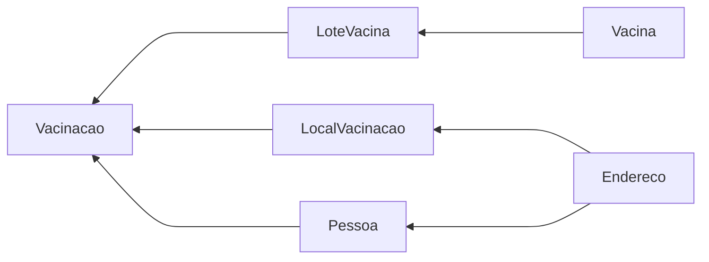

ASP.NET Core# MVC Challenge - Vaccine management system

This project is an application for simulating a vaccine management system.
This app allows the user to check information regarding places for taking vaccines (**Locais**), vaccine´s batches(**Lotes**) and vaccines(**Vacinas**) in order to disseminate and make information available for the population.
For users with admin account it is possible to **C**reate, **R**ead, **U**pdate and **D**elete information regarding vaccines and people taking it.

## Hot-To-Run

- First a DataBase must be created in order to execute the operations described above, the information for creating the DB is as bellow:
  > DB: MySql;
  > Server: localhost;
  > Port: 3306
  > Name: desafiomvc;
  > uid: root;
  > password: root;

1. Certify the Migrations folder in the app´s root is empty;
2. Run the following commands in the shell:
   > 1. **dotnet restore**
   > 2. **dotnet ef migrations add CreateIdentitySchema --context ApplicationDBContext**
   > 3. **dotnet ef database update --context ApplicationDBContext**
   > 4. **dotnet watch run**
3. Access: https://localhost:5001/
4. Register a new account (suggested -> e-Mail: test@test.com; password: 123456)
5. In order to populate the database access: https://localhost:5001/Admin/PopularDBWarning ;

## About the app

All navigation is done through the NavBar; there you will find links to the app´s areas.

- _Administrativo_:
  --Allow the admin user to **Register** items to the DB, allows for **Vaccination** and **Reading** reports regarding the vaccinations; inside the reports you will find the buttons that allows for **Updating** and **Deletion**;

- _Locais_:
  --Allows the user to **Read** a list of places where vaccination is being inoculated;

- _Vacinas_:
  --Allows the user to check all vaccines available to the system registered by admins;

- _Lotes_:
  --Allows the user to check all batches being used for vaccination;

- _Log in_:
  --Logs an admin in;

- _Log out_:
  --Logs an admin out;

- _Registrar_:
  --Allows a user to create and admin user and a password so he/she can access all system functionalities;
  > e-Mail confirmations and levels of access are disabled so testing becomes easier; in order to enable such functionalities please insert these rules in RegisterModel and make the alterations as needed.

## Additional information

- This app was created using:
  -- Microsoft ASP.Net 3.1;
  -- Microsoft ASP.NET Core Entity Framework 3.1.17;
  -- Pomelo Entity Framework MySql 3.1.17;
  -- Microsoft ASP.NET Core Identity 3.1.17;
  -- JQuery mask 1.14.15;

## Entities

| Entidade       | Atributos                                                                                                                                                                                                  |
| -------------- | :--------------------------------------------------------------------------------------------------------------------------------------------------------------------------------------------------------- |
| Endereço       | <ul><li>Id : int</li><li>Cpf : string</li><li>Logradouro : string</li><li>Numero : string</li><li>Complemento : string</li><li>Cidade : string</li><li>Estado : string</li><li>Status : bool</li></ul>     |
| Pessoa         | <ul><li>Id : int</li><li>Cpf : string</li><li>Nome completo : string</li><li>Data de nascimento : DateTime</li><li>Endereco : Endereco</li><li>Status : bool</li></ul>                                     |
| LocalVacinacao | <ul><li>Id : int</li><li>Nome : string</li><li>Endereco : Endereco</li><li>Status : bool</li></ul>                                                                                                         |
| Vacina         | <ul><li>Id : int</li><li>Nome : string</li><li>Laboratorio : string</li><li>Posologia : bool</li><li>Intervalo : int</li><li>Status : bool</li></ul>                                                       |
| LoteVacina     | <ul><li>Id : int</li><li>Vacina : Vacina</li><li>Lote : string</li><li>QtdRecebida : int</li><li>QtdRestante : int</li><li>DataRecebimento : DateTime</li><li>DataValidade</li><li>Status : bool</li></ul> |
| Vacinacao      | <ul><li>Id : int</li><li>Data : DateTime</li><li>Pessoa : Pessoa</li><li>Lote : LoteVacina</li><li>Local : LocalVacinacao</li><li>Dose : bool</li><li>Status : bool</li></ul>                              |
